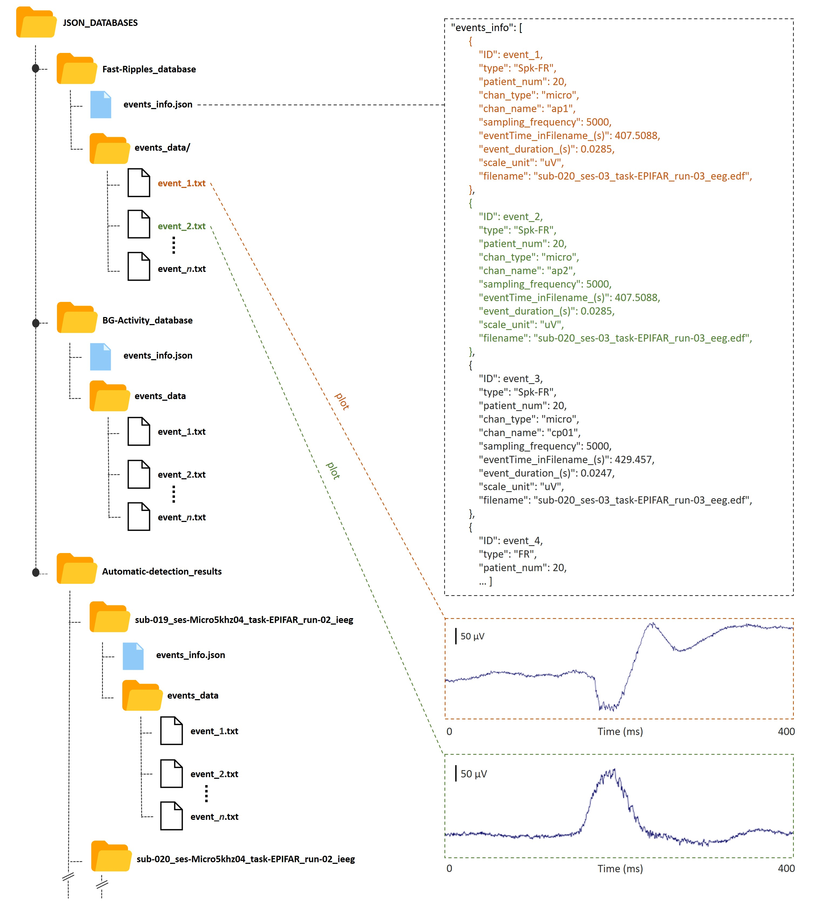
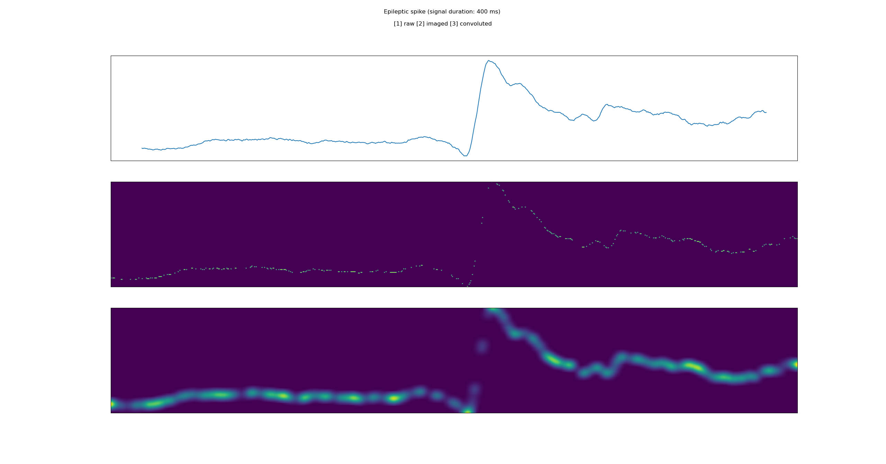

# Convolutional Kernel Density Estimation (CKDE)

## Description
This program presents Convolutional Kernel Density Estimation, a method used to detect intercritical epilpetic spikes (IEDs) in [Gardy et al., 2019](https://doi.org/10.5220/0008877601010109).

User provides a time series as input. The algorithm will perform the following steps:
- Transform the timeseries into an image
- Convolve this image

User can then apply filters, like a low-pass filter, to isolate low density events, such as IEDs.

```sh
python main.py  # Runs the script
```

## Installation

### Prerequisites
- Python 3.11
- Python libraries: see requirements.txt

## Usage
```python
### Get a timeseries filepath (look in the folder you have downloaded)
timeseries_folderpath = r"test_events_database\events_signal_data"
timeserie_filename = f"event_{event_num}.txt"

### Load a timeseries from the sample data provided with this program (1D)
signal = load_timeseries(timeseries_folderpath, timeserie_filename) # or,
#signal = random_signal_simulation()

### Get the timeseries info
json_dict = json.load(open(r"test_events_database\events_info.json"))
sfreq = json_dict["events_info"][event_num]["sampling_frequency"]

### Convert it to a 2D signal
image_2D = from_1D_to_2D(signal, bandwidth = 1)

### Convolve the 2D signal
image_2D_convolved = convolve_2D_image(image_2D, convolution = "gaussian custom")

### Plot result
fig_name = "Epileptic spike (signal duration: 400 ms) \n\n[1] raw [2] imaged [3] convoluted"
plot_result(signal, image_2D, image_2D_convolved, fig_name)
```

## Data
We propose some simulated data to validate our procedure with a known frequency, duration and position. This database is structured as shown in figure 1. User can either use these data, use his own, or simulate some. A signal simulation function is also provided in the program.



## Methods
Figure 2 shows how the convolved image (2D) is drawn from the raw signal (1D). A: Convolution process. B: Full process.


## Results
Figure 3 shows the result of the full process. The timeseries used as input is an IED called "event_5" in the data sample we provide with this program.



## References
Gardy, L., Barbeau, E., and Hurter, C. (2020). Automatic detection of epileptic spikes in intracerebral eeg with convolutional kernel density estimation. In 4th International Conference on Human Computer Interaction Theory and Applications, pages 101–109. SCITEPRESS-Science and Technology Publications. https://doi.org/10.5220/0008877601010109


## Author
- LinkedIn: [Ludovic Gardy](https://www.linkedin.com/in/ludovic-gardy/)
- Doctoral thesis: [PDF](http://thesesups.ups-tlse.fr/5164/1/2021TOU30190.pdf)